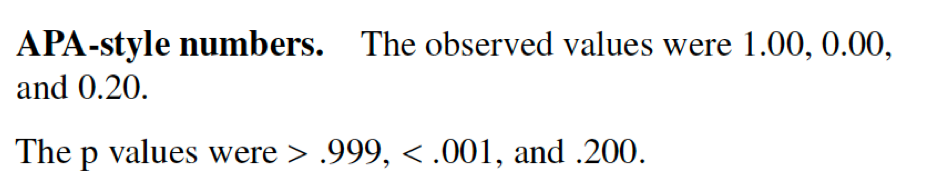

background-image: url(img/neven-krcmarek-V4EOZj7g1gw-unsplash.jpg)
background-position: center
background-size: contain
class: center, middle
# <br>
# Reproducible Research <br> in R

### Andreas M. Brandmaier

#### University of Leipzig | `r Sys.Date()`
---

class: middle, center

```{r setup, include=FALSE}
knitr::opts_chunk$set(echo = TRUE)

# Some sources
#
# https://github.com/brandmaier/reproducible-data-analysis-materials/blob/main/docs/BioPsy2020.Rmd
# https://github.com/aaronpeikert/repro-workshop/blob/main/presentation.Rmd

repro::automate_load_packages()


library(RefManageR)
BibOptions(check.entries = FALSE, bib.style = "authoryear", style = "markdown",
           dashed = TRUE)

BibOptions(hyperlink=FALSE);

bib <- ReadBib("references.bib")
```

```{r xaringan-themer, include=FALSE, warning=FALSE}
primary_color <- "#024959"
secondary_color <- "#F2D605"
xaringanthemer::style_duo(
  primary_color = primary_color,
  secondary_color = secondary_color,
  header_font_google = google_font("Didact Gothic", "400", "400i"),
  text_font_google   = google_font("IBM Plex Sans", "400", "400i"),
  text_font_size = "1.5rem",
  )

style_extra_css(css = list(".todo" = list(color = "#17C25B"),
                           ".optional" = list(color = "#05BCE6"),
                           ".large" = list(`font-size` = "130%"),
                           ".small" = list(`font-size` = "80%"),
                           ".tiny" = list(`font-size` = "50%"),
                           ".full" = list(padding = "0px",
                                          margin = "0px",
                                          border = "0px"),
                           ".emph" = list(color = "#05BCE6"),
                           ".del" = list(`text-decoration`="line-through"),
                           ".vertical" = list(`writing-mode` = "vertical-rl",
                                              `text-orientation` = "mixed")),
                )
```
Please ask questions anytime
---
class: center, middle

# Reproducible Research

# =

# same data + same analysis

# =

# same results

---
class: inverse, center, middle

# Why should we work reproducibly?
---

# Why should we work reproducibly?

Many good reasons like 

- Transparency
- Trustworthiness
- Replication

---

## Your closest collaborator is you six months ago, but you don’t reply to emails.

.footnote[From Karl Broman's lecture on reproducibility, paraphrasing Mark Holden]

---
class: inverse, center, middle
# What should be reproducible?
---
class: inverse, center, middle
# Everything
---
class: inverse, center, middle
# (Almost) Everything
---

# Statistical Data Analysis

- Replication attempt of articles in journal _Cognition_ `r Citep(bib, "hardwicke2018data")`
- Out of 35 published articles with open code and data, the results of 22 articles could be reproduced, 
- Further assistance from the original authors was required in 11 cases
- For 13 articles, at least one outcome could not be reproduced—even with the original authors’ assistance. 
---
# Statistical Data Analysis

- in 62 registered reports only 41 had data available, and 37 had analysis scripts available `r Citet(bib,"obels2020analysis")`. 
- The authors could execute only 31 of the scripts without error
- They reproduced the results of only 21 articles (within a reasonable time). 
--
- Lesson: Just because it's open data/code, it's not necessarily useful
 
---
# Power Analysis

Reproducibility of power analyses `r Citet(bib,"thibault2024evaluation")`:

- 2% reproduced
- (likely) 28% reproduced with additional assumptions 
- 75% not reported transparently enough to assess reproducibility (e.g., unclear whether power analysis matches later statistical analysis)

---
class: center, middle

```{r echo=FALSE, out.width= "30%"}
knitr::include_graphics("img/frustrating.gif")
```


.tiny[Meme by Aaron Peikert]

---
class: center, middle

```{r echo=FALSE, out.width = "50%"}

```

.tiny[Meme by Aaron Peikert]


class: inverse, center, middle
# How should we make our work reproducible?
---

# Rule 1: Keep your stuff together!

Always avoid local paths. Probably a good idea to add this to your `.Rprofile`:

```{r echo=TRUE}
setwd <- function(...) { stop("Bad boy!")}
```
--
Then:
```{r eval=FALSE}
setwd("C:/Users/brandmaier/SOEP")
```

> Error in `setwd()`: Bad boy!

---
# Use `here`

Use RStudio and R projects instead

The command `here` retrieves files relative to project root

```{r}
here("data/soep.csv")
```

*Project should be self-contained*
---

# Sources of Failure to Reproduce Results

.pull-right[  ]

1. *Multiple versions of scripts/data* (e.g., dataset has changed over, i.e., was further cleaned or extended)

--

2. *Multiple scripts* in a pipeline; unclear which scripts should be executed in which order

--

3. *Copy&paste errors* (e.g., inconsistency between reported result and reproduced result)

--

4. Broken *software dependencies* (e.g., analysis broken after update, missing package, just comes out differently on a different computer )


---

# Four Elements of Reproducibility

.center[

```{r, echo=FALSE, out.width='60%'}
knitr::include_graphics("https://raw.githubusercontent.com/aaronpeikert/repro-tutorial/main/images/nutshell.png")
```

]

.footnote[from Peikert and Brandmaier (2020)]

---

class: left, middle, inverse
background-image: url(http://3.bp.blogspot.com/-c7bI_n5oXd0/U7vTYArmRoI/AAAAAAAAKoQ/3JkxLM2PRKo/s1600/gospels-meme.jpg)
background-position: right

<!-- -----------------------------

Part 1: Version Control

--------------------------------- -->

# Version Control

---
class: inverse, middle, center
# Problem: Multiple versions of scripts/data

---

## Version control in a nutshell

--

### Version 1 → Version 2 → Version 3 → Current

--

### +

### Time travel

--

### +

### Change detection

---

# Version Control

### Version Control

.pull-left[

- Version control systems (VCS) such as `git` record changes to a set of files over time so that you can restore specific versions
later.

- VCS guarantee that code and data are exactly the same
version as used for publication.

- Reduces the number of dead or dysfunctional code lines (deletion is safe and branches help separate productive and experimental code)

]

.pull-right[


]
---

background-image: url(img/screenshot_github_releases.png)
background-size: contain

# Releases on github.com

---

# Long-Term Storage

- GitHub has no long-term guarantees for the availability of its service

--

- even though they do .emph[LOCKSS] (for Lots Of Copies Keeps Stuff Safe, e.g., the Artic World Archive)

--

- Mirror snapshots with meta-data and DOI to other providers (e.g., Zenodo, FigShare, OSF)

- This helps making the repository (F)indable (as in FAIR)

<!-- -----------------------------

Part 2: Dependency Management

--------------------------------- -->
---

background-image: url(img/claudio-schwarz-purzlbaum-qjX0QBtDXto-unsplash.jpg)
background-size: cover
background-position: right top
class: left, middle, inverse, clear


# <br><br><br><br><br>Dependency Management


---

### Problem

.pull-left[
Once someone found our files... 
which of those files are executable and in which order are they to be executed?
]

---

class: middle
## Whats cooking?

.pull-left[

> Arrabbiata sauce, or sugo all'arrabbiata in Italian, is a spicy sauce for pasta made from garlic, tomatoes, and dried red chili peppers cooked in olive oil. 

.small["Arrabbiata sauce" from Wikipedia under [CC BY-SA 3.0](https://en.wikipedia.org/wiki/Wikipedia:Text_of_Creative_Commons_Attribution-ShareAlike_3.0_Unported_License)]

]

---
class: middle
## Whats cooking?

.pull-left[

> Arrabbiata sauce, or sugo all'arrabbiata in Italian, is a spicy **sauce** for **pasta** made from **garlic**, **tomatoes**, and dried red **chili** peppers cooked in olive oil. 

.small["Arrabbiata sauce" from Wikipedia under [CC BY-SA 3.0](https://en.wikipedia.org/wiki/Wikipedia:Text_of_Creative_Commons_Attribution-ShareAlike_3.0_Unported_License), emphasis added]

]

--

.pull-right[

.large[

```
arrabiata.pdf: arrabiata.Rmd sauce.csv R/pasta.R 
  Rscript -e "rmarkdown::render('arrabiata.Rmd')"

sauce.csv: R/cook.R tomatoes.zip aromatics.yaml
  Rscript -e "source(R/cook.R)"

aromatics.yaml: R/sizzle.py garlic.txt chili.json
  python sizzle.py garlic.txt
  python sizzle.py chili.json
```

]

]

---

background-image: url(https://www.gnu.org/graphics/empowered-by-gnu.svg)
background-size: 20% 38%
background-position: right top

# GNU Make
---


# Solution: Make

## A Makefile

- contains a number of recipes

- Each recipe contains its ingredients (=dependencies) and commands to create the product

- There is a default recipe (defined entry point)

- By convention, there is an .emph[„all“] recipe to create everything 

- Recipes can depend on other recipes and/or files

---

# Make

## Why Make?

- A single, well-defined entry point for your analysis (default target):
	`make`
	
- Management of all external dependencies in one file via (dependend) targets, such as 

  - Installing extra software

  - Starting external programs (such as pre-processing pipelines)

  - Downloading data from external repositories

---

# Key features

Missing ingredients will be generated,  
.small[*e.g., if the cleaned data is missing, the raw data is first cleaned.*]

Newer ingredients trigger updates,  
.small[*e.g., new data leads to recreation of the whole manuscript.*]

Always the same "button" that triggers reproduction,  
.small[*e.g., regardless of programming language, file format, and intermediate steps.*]

---
# Example Makefile

### Makefile Schema

```{bash, eval=FALSE}
recipe name: ingredients
  instructions
```

--

### An example Makefile
```{bash, eval=FALSE}
all: manuscript.pdf

manuscript.pdf: data/iris_prepped.csv manuscript.Rmd
  Rscript -e 'rmarkdown::render("manuscript.Rmd")'

data/iris_prepped.csv: R/preprocess_data.R data/iris.csv
  Rscript -e 'source("R/preprocess_data.R")'
```

---

# Native R alternative?

Alternative: build automation using the `targets` package `r Citet(bib,"targets2021")` 

- using `tar_target(y, f(x))` instead of `y <- f(x)`
- then `tar_make()` builds/updates all targets
- like in Make, things are built only if they changed
- built-in visualization of dependency graph 

<!-- -----------------------------

Part 3: Containers

--------------------------------- -->
---


background-image: url(img/chris-linnett-jQ6bMceL4Gw-unsplash.jpg)
background-size: cover
background-position: right top
class: left, middle, inverse, clear
<!-- -----------------------------

Containerization

--------------------------------- -->

# Containerization


---


class: inverse, middle
# Problem: Broken *software dependencies* ('dependency hell')
---

# Docker

A Docker container is like a shareable virtual machine that runs identically on any computer (Linux, macOS, Windows)

- You can either provide a short .emph[recipe] how to create a container (few kilobytes) or 
- the entire .emph[container] (few gigabytes)

---

# Docker Recipes

Recipes are instructions how to create a container from publicly available sources, e.g., 

-   Rocker project (Boettiger & Eddelbuettel, 2017), with pre-configured Debian images including R/Rstudio
<p style="color:white">- Microsoft R Application Network (MRAN) providing CRAN snapshots in their „time machine“ (out of service now!)</p>

```{bash, eval=FALSE}
{{FROM rocker/verse:3.6.1}}
ARG BUILD_DATE=2019-11-11
RUN install2.r --error --skipinstalled here lavaan
WORKDIR /home/rstudio
```

---

# Docker Recipes

Recipes are instructions how to create a container from publicly available sources, e.g., 

-   Rocker project (Boettiger & Eddelbuettel, 2017), with pre-configured Debian images including R/Rstudio
-   Microsoft R Application Network (MRAN) providing CRAN snapshots in their „time machine“ (out of service now!)

```{bash, eval=FALSE}
FROM rocker/verse:3.6.1
ARG BUILD_DATE=2019-11-11
{{RUN install2.r --error --skipinstalled here lavaan}}
WORKDIR /home/rstudio
```


---

# The easy way

- The collection of installed packages is a _library_ in R

- The R package `renv` (Ushey & Wickham, 2024) separates system library from _project-specific local libraries_ in R

- Key concept: _isolation_ of your project's dependencies from your system and other projects (different projects can use different package versions)

---

# Components

- The project library, renv/library, is a library that contains all packages currently used by your project

- the renv.lock file, which contains meta data about the local library

- A project R profile `.Rprofile`, which is loaded once a project is loaded (remember `setwd()`)

---

# Commands

- Create a private R library with `renv::init()` (the project will now always rely on the local library)

- Update a library with `renv::snapshot()` (e.g. when updating packages to a newer version)

- Restore a library with `renv::restore()` 

.footnote[cf. the WORCS approach by van Lissa et al. (2020)]
---
class: center
# Overview


<small>Source: https://rstudio.github.io/renv/articles/renv.html</small>

---

# But is this really enough?
class: inverse, middle, center

---

# The case of pseudo random numbers

- Pseudo random numbers are important in modern statistics, e.g. permutation tests, bootstrapping, random forests but also for reproducible allocation of participants to experimental conditions

- PRN generators can be thought of as long lists of numbers that repeat only after a very long time (efficiently represented as a mathematical function); the list is determined by a starting condition (_seed_)

- For reproducibility, we need to fix that initial _seed_ (ideally by another random process)

---

# Examples of Non-Reproducible Code in R

Here are some examples of non-reproducible code that cannot be captured easily from within a given R environment

### 1.	Bugfix in random number generator in R between R 3.5 and R 3.6

```{r eval=FALSE}
set.seed(1234); 
sample(1:10, 5) 
```

--

```{r eval=FALSE}
2 6 5 8 9 (R3.5)
```

--

```{r eval=FALSE}
10 6 5 4 1 (R3.6.1)
```

---

# Examples of Non-Reproducible Code in R

Confidence intervals (95%) of a simple regression coefficient estimate (with identical random seed):

.pull-left[
```{r eval=FALSE}
[1] "R version 3.5.0 (2018-04-23)"

2.5 % 97.5 %
 0.0097 0.3842
```
]

.pull-right[
```{r eval=FALSE}
 [1] "R version 3.6.1 (2019-07-05)"

 2.5 % 97.5 %
 -0.0005 0.3748
```
]

.footnote[Note that the results are not reproduced but replicated.]

---

#  Examples of Non-Reproducible Code in R
	
### 2.	Locale-dependent behavior (e.g., English vs Lithuania):

```{r eval=FALSE}
sort(state.abb) 

[1] "AK" "AL" "AR" "AZ" "CA" "CO" "CT" "DE" "FL" "GA" "HI" "IA" 
[13] "ID" "IL" "IN" "KY" "KS" "LA" "MA" "MD" "ME" "MI" "MN" "MO" 
[25] "MS" "MT" "NC" "ND" "NE" "NH" "NY" "NJ" "NM" "NV" "OH" "OK" 
[37] "OR" "PA" "RI" "SC" "SD" "TN" "TX" "UT" "VA" "VT" "WA" "WI" 
[49] "WY" "WV"
```

---
class: inverse, center, middle
# There is a need for reproducible computational environments


---

# Containers

### Docker containers 

- guarantee identical execution of its contents across platforms (and time) including cloud computing

--

- can run interactively: R/Rstudio can run in the container (i.e., there is no need to ever run the analysis in your local computing environment)

--

- Analyses can be run in different containers (simulating different package versions) to find out what downstream updates broke your code / your results


---


class: left, middle, clear
background-image: url(img/neven-krcmarek-V4EOZj7g1gw-unsplash.jpg)
background-position: right middle
background-size: cover

<!-- -----------------------------

Part 4: Dynamic Document Generation

--------------------------------- -->

# <br><br><br><br><br>Dynamic Document<br>Generation

---

# R Markdown Example

.pull-left[

]
..pull-right[

]
---

# Number reporting (APA style) with papaja

.pull-left[

]

.pull-right[


]

---

# Reporting statistics with papaja

.pull-left[ ]
.pull-right[ ]

---
# Linear model
```{r results="asis"}
stargazer(attitude, summary=FALSE)
linear.1 <- lm(rating ~ complaints + privileges + learning 
                        + raises + critical, data=attitude)
stargazer(linear.1, type="html")
```
---
# Correlation Matrix with `stargazer` 
```{r results="asis"}
correlation.matrix <- cor(attitude)
stargazer(correlation.matrix, type="html")
``` 

# Thank you, statcheck, we'll take it from here
class: inverse, middle, center


---
<!-- -----------------------------

Part 5: repro package

--------------------------------- -->
class: clear middle inverse

# The repro package

---

# YAML header (R Markdown)

A standard YAML header:

```{r, eval=FALSE}
---
title: My worst academic fails
author: Andreas Brandmaier
date: 2020-11-17
output: html_document
---
```

---

# YAML header (repro)

`repro` extends the YAML header of R Markdown to track dependencies on .emph[code] (internal scripts and external packages) and .emph[data] files.

---
# Example
```{r, eval=FALSE}
---
title: My worst academic fails
author: Andreas Brandmaier
date: 2020-11-17
repro:
  packages:
    - usethis
    - fs
    - aaronpeikert/repro@d09def75df
  scripts:
    - R/clean.R
  data:
    mycars: data/mtcars.csv
output: html_document
---
```


---

# System setup with repro

Load the package:

```{r echo=TRUE,eval=TRUE, message=FALSE}
library(repro)
```

Run some checks:

```{r}
check_git()
check_make()
check_docker()
```

---

# Project setup with `repro`

- Use `repro::automate()` to make an existing RMarkdown analysis reproducible

- creates a Dockerfile & Makefile based on every RMarkdown in the project folder

- use `automate_load_packages()` to load all packages in your script, `automate_load_data`() for data, and  `automate_load_scripts()` to attach external scripts

---

# Under the hood

```{r}
cat("
✔ Setting active project to 'C:/Users/andreas.brandmaier/LokaleDokumente/GitHub/reproducibility_workshop'
✔ Directory `.repro` created!
✔ Writing '.repro/Dockerfile_base'
✔ Writing '.repro/Dockerfile_packages'
✔ Writing '.repro/Dockerfile_manual'
✔ Writing 'Dockerfile'
✔ Writing '.repro/Makefile_Rmds'
✔ Writing '.repro/Makefile_Docker'
✔ Writing '.dockerignore'
• Modify '.dockerignore'
✔ Writing 'Makefile'
• Modify 'Makefile'
• Maybe you want to add:
  'repro.html'
  to the 'Makefile'-target 'all'.")
```
---
# Docker


---

# Reproduction

To reproduce a project completely:

```{r eval=FALSE}
library(repro)
reproduce()
```


---


# Outlook

	
## Long-term sustainability is a continuing challenge for the community

- We need academic repositories that

  - are freely accessible (no commercial interests)
  - guarantee long-term reproducibility (independent of short-term grants)
  - provide not only disk space but software infrastructure and computational environments

- We need to better recognize the efforts of maintaining scientific software (such as repro and many others) and curating digital collections

---


class: middle, center

# What could possibly go wrong?
```{r out.width="30%", echo=FALSE, eval=TRUE}

# 
```

---
# Problems

- Docker not available (e.g., no admin rights, unsupported computing platform)
- After upgrading to new R, new package versions, new computer, do results still reproduce?

---
# Solution

## reproducibleRchunks 
--
## are just like regular R chunks
--
## but verify reproducibility of computations 

---
# reproducibleRchunks

 
---


---


---


---
# How does it work?

```{r}
set.seed(42)
numbers <- sample(1:10, 5)
```

becomes a serialized JSON file:

\begin{verbatim}
```{r echo=FALSE, eval=TRUE, results="asis"}
content <- jsonlite::serializeJSON(numbers, pretty=TRUE)
content <- gsub(pattern="\\n",replacement="  \n", x=content)
cat(content)
```
\end{verbatim}

---
# What are valid variables?

All of the following variables (`x` of class _integer_, `y` of class _character_, `z` of class _lm_, and `lst` of class _list_) are valid examples for the automated reproducibility checks:

```{r examples, eval=FALSE, echo=TRUE}
  x <- 1:10
  y <- "qr"
  z <- lm(x~1, method=y)
  lst <- list(x, y, z)
```

---
class: inverse, center, middle
# What should be reproducible?
---
class: inverse, center, middle
# (Almost) Everything
---
## Some things we do not care about

Time information such as:
- current time or date
- run time of a model
- time elapsed for a given computation

Other information that changes between sessions (shoud be avoided anyhow):
- user names
- local paths 

---

class: center

# Extract only necessary bits from a model and verify them

The `broom` package has a generic function `tidy` with model-specific functions (e.g., lm, anova, factanal, glm, lavaan, gam,...) to extract all relevant parameter estimates:

```{r echo=TRUE, eval=TRUE}
x <- rnorm(10)
y <- rnorm(10)
broom::tidy(lm(y~x))
```
---
# Outlook: PAC 

- preregistration currently entail a lot of work because we need two write two manuscripts (prereg + final ms)

- preregistrations still suffer from ambiguities of written language, omissions, underdefined processes

- With reproducible pipelines, we could move towards Preregistration as Code (PAC)

---
# Outlook: PAC 

Advantages

- Write your manuscript once with everything but the discussion
- Generate all tables and figures based on simulated data
- Once real data is collected, replace data, reproduce manuscript
- Deviate from original plan if necessary, summarize, also: all changes are _transparently_ documented in git
- Write discussion, done.
---
# How would this look in practice?

Example online here ("gender differences in Machiavellianism") `r Citep(bib,"peikert2021reproducible")` including power analysis

![https://github.com/aaronpeikert/repro-tutorial/blob/main/preregistration.Rmd]

Modifications we had to make after the simulated PAC:

- recoding gender from (1,2) to (male, female)
- removal of NA values was missing
- half of the items of Machiavellianism are reverse-coded

---
# Take-home message

```{r echo=FALSE, out.width= "30%"}
knitr::include_graphics("img/frustrating.gif")
```

---

# Where to start

```{r echo=FALSE,eval=TRUE}
link <- "https://github.com/brandmaier/reproducibleRchunks"
link2 <- "https://github.com/aaronpeikert/repro"

generate_svg(qr_code(link), here::here("img/", "qr_reproducibleRchunks.svg"), foreground = secondary_color, background = primary_color, show = FALSE)

generate_svg(qr_code(link2), here::here("img/", "qr_repro.svg"), foreground = secondary_color, background = primary_color, show = FALSE)
```

```{r eval=TRUE, echo=FALSE}


```

---

# Thank you!

If you want to know more:

  - Ask us a question via a [github issue](https://github.com/aaronpeikert/repro/issues)
  - Follow [@brandmaier](https://twitter.com/brandmaier) on twitter
  - Read our [preprint](https://psyarxiv.com/8xzqy/)
  - Contribute to our [repro](https://github.com/aaronpeikert/repro) repository on GitHub or [reproducibleRchunks](https://github.com/brandmaier/reproducibleRchunks)


---

# License Information

- This presentation is distributed under CC-BY 4.0 unless otherwise stated or other sources are mentioned
- The ananas image on the title and other unsplash images were provided under the Unsplash License.
- The GNU logo was provided under the Free Art License.

---

# References

.small[
```{r, results='asis', echo=FALSE}
PrintBibliography(bib)
```
]
